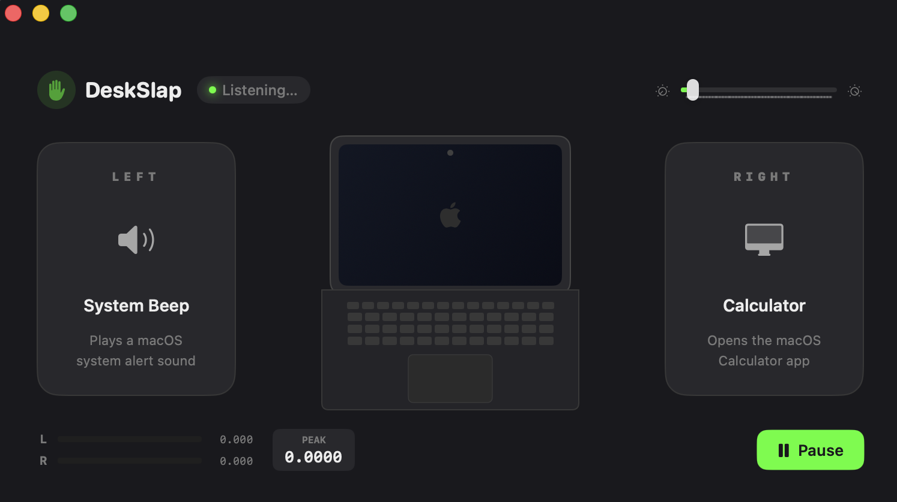

# ✋ DeskSlap

DeskSlap is an innovative macOS application that actively monitors audio to detect physical "desk slaps" and triggers customizable actions on your computer. With a sleek main window and a convenient menu bar extra, it's never been easier to control your Mac with a simple tap on your desk!

## 📸 App Screenshot

> **Note:** Make sure to place an image named `screenshot.png` in the root of the repository to display the app screenshot above.

## 🚀 Features

- **Audio Monitoring**: Detects desk slaps reliably using your Mac's microphone.
- **Customizable Actions**: Configure exactly what happens when a desk slap is detected.
- **Menu Bar Integration**: Quick access to DeskSlap controls right from your macOS menu bar.
- **Modern UI**: Clean and intuitive SwiftUI interface tailored for macOS.

## 📥 How to Download

You can download the latest compiled build of DeskSlap directly from the GitHub Releases section!

1. Go to the **Releases** page on this GitHub repository (look for the "Releases" section on the right side of the repository home page).
2. Find the latest release version marked as Production or Latest.
3. Download the `DeskSlap.app.zip` or `.dmg` file from the **Assets** section of the release.
4. Extract the downloaded file and drag `DeskSlap.app` into your `Applications` folder.
5. Open the app and grant microphone permissions when prompted so it can accurately listen for desk slaps.

## 🛠 Building from Source

If you prefer to build the app from source:

1. Clone the repository to your local machine.
2. Open `DigitalDesk.xcodeproj` in Xcode.
3. Select your Mac as the build destination.
4. Hit `Cmd + R` to build and run the application!

## 🛡 Privacy & Permissions

DeskSlap requires **Microphone access** to analyze audio levels and detect physical slaps on your desk. Audio is processed entirely locally on your device in real-time, and is **never** recorded, stored, or sent to any external servers.
